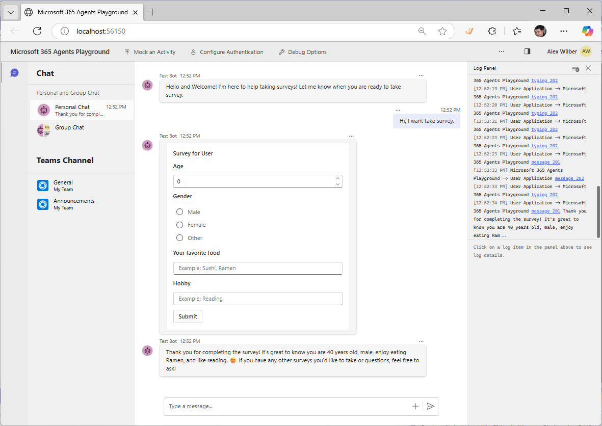

# Adaptive Card Survey Agent (Sample09M365Agent)

This README merges the guidance from:

- `Sample09M365Agent/Sample09M365Agent/README.md`
- `Sample09M365Agent/M365Agent/README.md`

The sample demonstrates an AI agent that helps users complete surveys using adaptive cards in Microsoft Teams.

The app uses Microsoft 365 Agents SDK and Semantic Kernel to provide structured AI responses and adaptive card interactions.



## Features

- Conversational survey experience in Teams
- Adaptive card-based input (age, gender, food preferences, hobbies)
- Structured AI output using JSON schema patterns
- Azure OpenAI-powered responses

## Prerequisites

To run locally, prepare the following:

- Azure OpenAI resource with a deployed GPT model (for example, `gpt-4` or `gpt-4.1-mini`)
- Visual Studio 2022 or later
- .NET 9 SDK
- Microsoft 365 work or school account (for Teams debugging)

## Quick Start

### 1. Configure Azure OpenAI

This sample has two common configuration styles depending on the project/settings you use.

Option A: `appsettings.Playground.json` or `appsettings.Development.json`

```json
"Azure": {
  "OpenAIApiKey": "<your-azure-openai-api-key>",
  "OpenAIEndpoint": "<your-azure-openai-endpoint>",
  "OpenAIDeploymentName": "<your-azure-openai-deployment-name>"
}
```

You may also see this alternative section:

```json
"AIServices": {
  "AzureOpenAI": {
    "DeploymentName": "<your-deployment-name>",
    "Endpoint": "<your-azure-openai-endpoint>",
    "ApiKey": "<your-azure-openai-api-key>"
  },
  "UseAzureOpenAI": true
}
```

Option B: `env/.env.local.user`

```env
SECRET_AZURE_OPENAI_API_KEY="<your-azure-openai-api-key>"
AZURE_OPENAI_ENDPOINT="<your-azure-openai-endpoint>"
AZURE_OPENAI_DEPLOYMENT_NAME="<your-azure-openai-deployment-name>"
```

### 2. Debug in Microsoft 365 Agents Playground

1. Fill Azure OpenAI settings (typically in `appsettings.Playground.json`).
2. Set Startup Item to `Microsoft 365 Agents Playground (browser)`.
3. Press `F5` (Debug > Start Debugging).
4. In the launched playground, send messages such as:
   - `I want to take a survey`
   - `Show me a survey`
   - `I'd like to provide my profile information`

Reference image:


### 3. Debug in Teams Web Client

1. Configure required local settings:
   - Azure OpenAI values (`appsettings.Development.json` or `env/.env.local.user`)
   - If required by your project setup, Bot Service Connection in `appsettings.Development.json`:

```json
"TokenValidation": {
  "Audiences": {
    "ClientId": "<your-microsoft-entra-app-client-id>"
  }
},
"Connections": {
  "BotServiceConnection": {
    "Settings": {
      "ClientId": "<your-microsoft-entra-app-client-id>",
      "ClientSecret": "<your-microsoft-entra-app-client-secret>"
    }
  }
}
```

2. In the debug dropdown, create/select a public Dev Tunnel.
3. Right-click the project (`Sample09M365Agent` or `M365Agent`) and choose:
   `Microsoft 365 Agents Toolkit > Select Microsoft 365 Account`
4. Sign in with a Microsoft 365 work or school account.
5. Set Startup Item to `Microsoft Teams (browser)`.
6. Press `F5`.
7. In Teams, install the app and start chatting with prompts like `I want to take a survey`.

Reference image:


## Configuration Files

| File | Purpose | Typical required values |
|------|---------|-------------------------|
| `appsettings.Playground.json` | Playground local debug settings | Azure OpenAI key, endpoint, deployment |
| `appsettings.Development.json` | Teams debug settings | Azure OpenAI values, optional Bot Service Connection, token validation |
| `env/.env.local.user` | Environment-based local secrets | Azure OpenAI key, endpoint, deployment |
| `appsettings.json` | Base settings | General app configuration |

## How It Works

1. User asks to take a survey.
2. Agent interprets intent with Azure OpenAI.
3. Agent triggers survey card rendering.
4. Adaptive card collects responses.
5. Agent processes and returns structured output.

## Project Structure (Representative)

- `Sample09M365Agent/AFAgentApp.cs`: Agent framework setup
- `Sample09M365Agent/Agents/MySurveyAgent.cs`: Main survey agent logic
- `Sample09M365Agent/Agents/AdaptiveCardAIContent.cs`: Adaptive card content handling
- `Sample09M365Agent/Models/MySurveyAgentResponse.cs`: Structured response model
- `Sample09M365Agent/Models/MySurveyContent.cs`: Survey payload model
- `Sample09M365Agent/Program.cs`: Entry point

## Security Note

Do not commit secrets such as API keys, client secrets, or tokens to source control.
Use local secrets, environment variables, or Azure Key Vault for secure management.

## Additional References

- [Microsoft 365 Agents SDK](https://github.com/microsoft/Agents)
- [Microsoft 365 Agents Toolkit documentation](https://docs.microsoft.com/microsoftteams/platform/toolkit/teams-toolkit-fundamentals)
- [Microsoft 365 Agents Toolkit CLI](https://aka.ms/teamsfx-toolkit-cli)
- [Microsoft 365 Agents Toolkit Samples](https://github.com/OfficeDev/TeamsFx-Samples)
- [Adaptive Cards documentation](https://adaptivecards.io/)
- [Set up Microsoft 365 Agents Toolkit CLI for local debugging](https://aka.ms/teamsfx-cli-debugging)
- [Teams Toolkit VS documentation](https://aka.ms/teams-toolkit-vs-docs)

## Report an Issue

From Visual Studio:

`Help > Send Feedback > Report a Problem`

Or file an issue:

- https://github.com/OfficeDev/TeamsFx/issues
